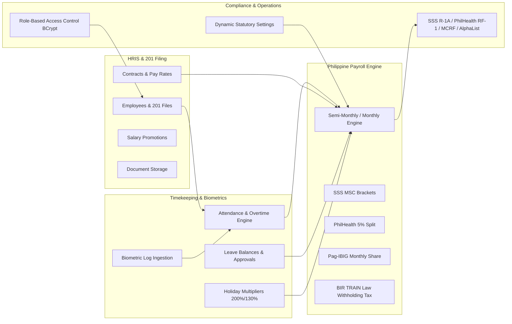

# Genetian GB Payroll System — Modern Enterprise UI/UX, Advanced HCI & Architecture Blueprint

This document is the definitive engineering and design standard for the **Genetian GB Payroll System**. It guarantees that any UI, code, or feature created in this repository meets **modern world-class desktop UI/UX standards (Windows 10 & Windows 11 Fluent / Modern Enterprise SaaS)**, adheres to **Advanced Human-Computer Interaction (HCI)** principles, ensures **non-breaking code stability**, and enforces **zero data leakage (Philippine RA 10173)**.

---

## 1. System Anatomy & Tech Stack

```
GB_Payroll_System/
├── Assets/                 # Branding (logo.png, favicon.ico, app_icon.ico)
├── Models/                 # Domain POCOs, Enums, and DTOs
├── Data/                   # Repositories (Dapper SQL queries & transactions)
├── Services/               # Business logic, statutory calculations, auth
├── Views/                  # XAML Windows, UserControls, and Dialogs
├── App.xaml / App.xaml.cs  # Global styles, color tokens, startup bootstrap
└── MainWindow.xaml / .cs   # Navigation hub, role-based dashboard, container
```

| Layer | Technology | Key Details |
| :--- | :--- | :--- |
| **Framework** | .NET 10.0 WPF (`net10.0-windows`) | High-DPI support, XAML resource dictionaries, MVVM / Repository |
| **OS Target** | Windows 10 (1809+) & Windows 11 | Cross-version Fluent UI styling, graceful font/effect fallbacks, high-DPI Per-Monitor V2 |
| **Database** | PostgreSQL via `Npgsql` (v10+) | Hosted on PostgreSQL server, relational schemas, foreign keys, timestamps |
| **Data Access** | `Dapper` (v2.1+) | 100% Parameterized SQL, mapped to domain POCOs |
| **Security** | `BCrypt.Net-Next` | Salted password hashing, Role-Based Access Control (RBAC) |
| **Domain** | Philippine Statutory Compliance | SSS, PhilHealth, Pag-IBIG (HDMF), BIR Withholding Tax (TRAIN Law) |

---

## 2. Modern World-Class UI/UX Design System (Windows 10 & Windows 11)

To guarantee the application looks and feels like a **sleek, top-tier modern enterprise application** across both **Windows 10 and Windows 11**:

### 2.1 Cross-Windows Compatibility & Visual Refinement
* **Unified Fluent Aesthetic**: Regardless of whether the user runs Windows 10 or Windows 11, the app renders a unified, premium look with soft rounded corners (`8px-12px`), drop shadows, and modern card containers.
* **Font Fallback Stack**: Use `FontFamily="Segoe UI Variable, Segoe UI, -apple-system, Arial, sans-serif"`. On Windows 10, it seamlessly falls back to crisp `Segoe UI` without visual distortion or missing glyphs.
* **High-DPI & Multi-Monitor V2 Awareness**: All Windows and Controls must declare `SnapsToDevicePixels="True"` and `UseLayoutRounding="True"` to ensure razor-sharp rendering on 100%, 125%, 150%, 175%, and 200% DPI displays on both Windows 10 and 11.

### 2.2 Color Palette & Modern Design Tokens (`App.xaml`)
* **Signature Brand Gradients**:
  - Primary Window Background: Deep Sapphire (`#0A4D9C`) $\to$ Midnight Navy (`#06254A`)
  - Accent Primary Blue: `#002CFA` (Hover: `#0022C8`, Active/Pressed: `#001CA3`)
* **Surfaces, Elevation & Cards**:
  - Main Background: `#F8FAFC` (Slate Canvas)
  - Card Surfaces: `#FFFFFF` with smooth subtle shadows:
    `<DropShadowEffect BlurRadius="18" Opacity="0.06" Direction="270" ShadowDepth="3" Color="#0F172A"/>`
  - Container Borders: `1px` solid `#E2E8F0` or `#EDF2F7`
  - Corner Radiuses: Modern soft curves (`CornerRadius="8"` for inputs/buttons, `CornerRadius="12"` for cards/dialogs)
* **Modern Semantic Pill Badges (Soft Pastel Background + Vibrant Ink)**:
  - **Success / Active / Present / Approved**: Background `#DCFCE7`, Foreground `#15803D`, Border `#BBF7D0`
  - **Warning / Pending / Probationary / On-Leave**: Background `#FEF3C7`, Foreground `#B45309`, Border `#FDE68A`
  - **Danger / Absent / Rejected / Closed**: Background `#FEE2E2`, Foreground `#B91C1C`, Border `#FECACA`
  - **Info / Regular / Draft**: Background `#DBEAFE`, Foreground `#1D4ED8`, Border `#BFDBFE`
  - **Neutral / Inactive**: Background `#F1F5F9`, Foreground `#475569`, Border `#E2E8F0`

### 2.3 High-Precision DataGrid Standards
Every data table must look modern, spacious, and readable:
1. **Never allow default auto-generated columns**: Always set `AutoGenerateColumns="False"`.
2. **Column Alignment & Currency Formatting**:
   - Descriptive text columns: **Left-aligned**.
   - Identifiers, Dates, and Status Badges: **Centered**.
   - Numeric quantities, hours, and monetary values: **Always Right-Aligned** with `StringFormat='₱{0:N2}'` or `StringFormat='{}{0:N2}'`.
3. **Table Ergonomics**:
   - Header style: Subtle slate background (`#F1F5F9`), bold muted text (`#475569`), `12px` height padding, clear sorting glyphs.
   - Row styling: Alternating subtle row tint (`#FFFFFF` / `#F8FAFC`), smooth hover state (`#F0F4F8`).
   - Cell padding: Minimum `8px,10px` vertical/horizontal padding to avoid dense, cramped spreadsheet appearance.

### 2.4 Modern Form Controls & Ergonomics
* **Modern Inputs (`ModernInputStyle`)**: Height `42-46px`, soft background (`#F8FAFC`), subtle border (`#E2E8F0`), focus ring (`#002CFA`, `1.5px` border thickness with gentle glow).
* **Live Formatted Inputs**: Always format currency fields on blur using `CurrencyInputHelper` or structured masked inputs.
* **Persistent Visual Labels**: Every input must feature an explicit label above the box (never rely solely on disappearing watermark/placeholder text).

---

## 3. Advanced Human-Computer Interaction (HCI) Principles

### 3.1 Cognitive Load Reduction & Hick's Law
* **Progressive Disclosure**: Break complex or multi-parameter workflows (e.g. Biometric Import, New Payroll Run, Employee Onboarding) into step-by-step wizards or categorized tab views with breadcrumbs.
* **Visual Hierarchy**: Group related inputs into clearly bounded card panels with subtitles. Use clear visual contrast between primary actions (Solid Blue `#002CFA`), secondary actions (Outlined Gray `#E2E8F0`), and destructive actions (Crimson Outline/Fill `#DC2626`).

### 3.2 Fitts's Law & Touch/Pointer Ergonomics
* **Generous Target Sizes**: All interactive buttons, dropdowns, and clickable rows must have a minimum height of `38px-46px` and sufficient horizontal padding (`16px-24px`).
* **Visual Affordance & Micro-interactions**:
  - Buttons must show smooth hover transitions (`IsMouseOver`) and active press feedback.
  - Interactive table rows must indicate clickable state with pointer cursor and subtle highlight.

### 3.3 Zero-Lag Non-Blocking UI (Nielsen's Responsiveness Principle)
* **Async Database & Processing**: All database queries, batch payroll computations, biometric log parsing, and report exports **must** execute asynchronously (`await Task.Run(...)` or async Dapper calls) off the UI thread.
* **Loading Skeletons & Progress Rings**:
  - Never freeze the WPF dispatcher thread or leave the user guessing.
  - Display indeterminate progress rings or skeleton placeholders with informative status messages ("Ingesting 2,400 biometric punches...", "Computing PhilHealth 5% contribution brackets...").
* **Non-Disruptive Feedback**: Use lightweight in-app toast/banner alerts for non-critical confirmations rather than abrupt modal message boxes.

### 3.4 Error Prevention & Forgiving Design (Norman's Principles)
* **Real-Time Input Validation**: Mark erroneous inputs with a clear crimson border (`#E53935`) and an inline validation tooltip/helper label.
* **Destructive Action Confirmation**: Require a dedicated, informative confirmation dialog before deleting an employee profile, deleting a contract, or recalculating finalized payroll periods.
* **Full Keyboard Accessibility**:
  - Explicit `TabIndex` sequence across all form fields.
  - `IsDefault="True"` bound to primary confirm buttons; `IsCancel="True"` bound to cancel/escape buttons.
  - `Enter` key triggers search in filter boxes.
  - High-DPI support: `SnapsToDevicePixels="True"` and `UseLayoutRounding="True"` on all Windows and UserControls.

---

## 4. What Is Inside This System (Domain & Architectural Blueprint)



### 4.1 Module Directory
1. **Auth & RBAC (`AuthService.cs`, `UserRepository.cs`)**:
   - Roles: `Admin`, `HR`, `Accounting`, `Management`, and `Staff`.
   - Salted `BCrypt.Net` hash storage and dynamic role-based navigation rendering.
2. **Employee HRIS & 201 Filing (`EmployeeRepository.cs`, `Models/Employee.cs`)**:
   - Personal biographics, branch assignment, daily/monthly pay rates, working days factors (`313`, `261`, `365`), bank accounts, and statutory numbers.
   - Statutory deduction modes (`Auto`, `FixedAmount`, `Exempt`) and deduction schedules (`SplitBothCutoffs`, `FirstCutoffOnly`, `SecondCutoffOnly`).
3. **Contracts, Promotions & Document Management (`ContractRepository.cs`, `SalaryPromotionRepository.cs`, `DocumentRepository.cs`)**:
   - Tracks contract progression (Probationary, Regular, Contractual).
   - Audit trail of salary increases and position adjustments with approval metadata.
   - Categorized document storage for 201 requirements (Resume, NBI, IDs, Medical).
4. **Timekeeping, Attendance & Biometrics (`AttendanceService.cs`, `BiometricImportWizard.xaml`)**:
   - Direct device IP sync and CSV/Excel file import wizard.
   - Shift pairing logic, tardiness & undertime calculation against shift schedules.
   - Overtime ($125\%$) and Night Differential ($110\%$ from 10:00 PM to 6:00 AM).
   - Manual attendance adjustments with audit tracking.
5. **Leave & Holiday Management (`LeaveRepository.cs`, `HolidayRepository.cs`)**:
   - Yearly leave credits (VL, SL, EL) and approval workflows.
   - Regular (200% worked, 100% unworked) and Special Non-Working (130% worked) national and branch-level holiday multipliers.
6. **Philippine Payroll Computation Engine (`PayrollService.cs`, `PhilippineDeductionService.cs`)**:
   - Complete gross-to-net calculation algorithm.
   - **SSS**: MSC clamped between ₱5,000 and ₱35,000 ($4.5\%$ EE / $9.5\%$ ER).
   - **PhilHealth**: $5\%$ premium ($2.5\%$ EE / $2.5\%$ ER) on compensation clamped between ₱10,000 and ₱100,000.
   - **Pag-IBIG (HDMF)**: Standard ₱200/month employee and employer contributions.
   - **BIR Withholding Tax**: Semi-monthly bracket calculation under the TRAIN Law with minimum wage earner exemptions.
7. **Government Remittance Reports (`GovernmentReportRepository.cs`)**:
   - Export formats for SSS (R-1A, R-3), PhilHealth (RF-1), Pag-IBIG (MCRF), and BIR (1601-C / AlphaList).
8. **Dynamic Statutory Configuration (`StatutorySettingsRepository.cs`)**:
   - In-app runtime configuration of statutory contribution ceilings and deduction rates.

---

## 5. Security & Zero Data Leakage Rules (RA 10173 Compliance)

1. **PII Masking**: TIN, SSS, PhilHealth, Pag-IBIG, and bank account numbers must be masked in general overview tables (e.g., `000-***-***-000` or `****-****-1234`).
2. **Salary Confidentiality**: Basic rates and net pays are strictly gated behind role permissions (`Admin`, `HR`, `Accounting`).
3. **100% Parameterized Queries**: All database queries must use Dapper parameters. Never concatenate strings into SQL commands.
4. **Transaction Integrity**: Multi-table data mutations must run inside explicit database transactions.
5. **Sanitized Diagnostics**: Never expose database connection strings or raw exception stack traces in user-facing dialogs.

---

## 6. Pre-Implementation Quality Checklist

Before completing any task or code change in this repository, verify:
- [ ] UI strictly follows modern Fluent design tokens, soft corner radiuses (`8px-12px`), and subtle elevations on both **Windows 10 and Windows 11**.
- [ ] High-DPI rendering properties (`SnapsToDevicePixels="True"`, `UseLayoutRounding="True"`) and font fallback stacks (`Segoe UI Variable, Segoe UI`) are in place.
- [ ] DataGrids have `AutoGenerateColumns="False"`, right-aligned monetary amounts (`₱#,##0.00`), and pastel pill badges.
- [ ] Layout is responsive with `<ScrollViewer>` wrapping — zero clipping or fixed overflow.
- [ ] Database operations are asynchronous and non-blocking with loading progress feedback.
- [ ] SQL queries are 100% parameterized with Dapper inside explicit transactions where appropriate.
- [ ] PII and compensation data are protected under RA 10173 with proper role gating.
- [ ] Keyboard accessibility (`TabIndex`, `IsDefault`, `IsCancel`) is fully functional.
